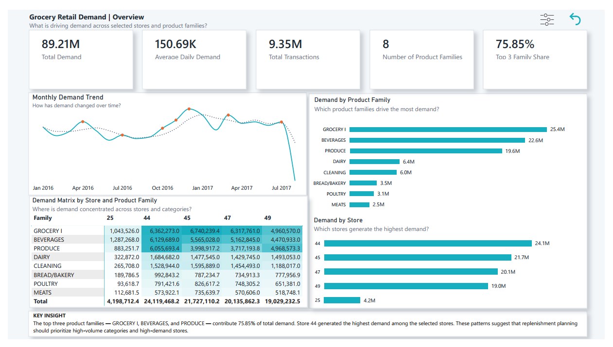
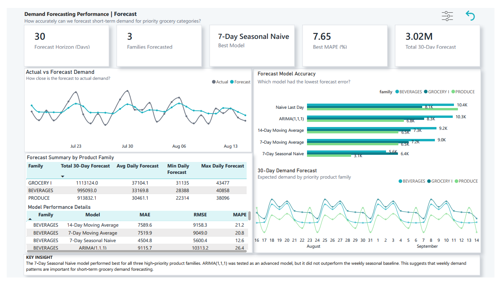
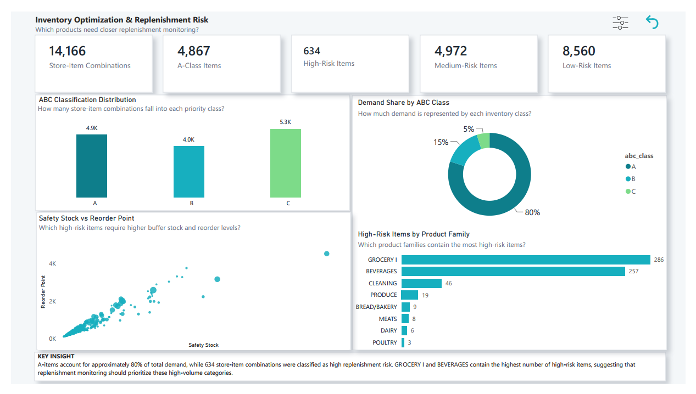

# Demand Forecasting and Inventory Optimization for a Grocery Retail Network

## Project Overview

This project analyzes grocery retail sales data to support demand planning and inventory decision-making.

The goal was not just to build charts, but to answer practical supply chain questions:

- Which product families drive the most demand?
- Which stores generate the highest demand?
- Can short-term demand be forecasted for priority product categories?
- Which items should receive closer replenishment attention?
- Which products carry higher potential replenishment risk?

The project uses historical grocery sales data from the Corporación Favorita dataset and combines Python analysis with a Power BI dashboard.

---

## Business Problem

Grocery retailers often deal with unstable demand, fast-moving products, slow-moving products, and replenishment challenges.

In this project, I worked as a supply chain analyst for a multi-store grocery retail network. The business needed a better way to understand demand patterns, forecast short-term demand, and prioritize inventory decisions.

The main business problems were:

- Demand varies across stores and product families.
- Some product categories move much faster than others.
- Inventory planning needs to focus on the products that matter most.
- Stockout risk cannot be confirmed directly because inventory-on-hand data is not available.
- Replenishment risk can still be estimated using demand volume, demand variability, safety stock, and reorder point logic.

---

## Tools Used

- Python
- Pandas
- NumPy
- Matplotlib
- Statsmodels ARIMA
- Power BI
- GitHub

---

## Dataset

The project uses the Corporación Favorita Grocery Sales Forecasting dataset.

Main data files used:

- train.csv
- items.csv
- stores.csv
- transactions.csv
- oil.csv
- holidays_events.csv

The original raw dataset is not included in this repository because of file size. The notebook workflow shows how the data was filtered, cleaned, and prepared for analysis.

---

## Project Scope

To keep the analysis focused and practical, I selected:

- 5 stores
- 8 product families
- Sales period from January 2016 to August 2017

The selected product families were:

- GROCERY I
- BEVERAGES
- PRODUCE
- DAIRY
- CLEANING
- BREAD/BAKERY
- MEATS
- POULTRY

This scope keeps the project manageable while preserving enough daily sales history for demand analysis, forecasting, and inventory planning.

---

## Project Workflow

The project was completed in five main notebooks:

### 1. Data Exploration

Notebook: `01_data_exploration.ipynb`

This notebook was used to understand the structure of the dataset before cleaning or modelling.

It covered:

- Loading sample data
- Checking table shapes
- Reviewing columns and data types
- Checking missing values
- Understanding product, store, transaction, oil, and holiday tables
- Identifying the relationships between tables

### 2. Master Dataset Creation

Notebook: `02_create_master_dataset.ipynb`

This notebook created the final working dataset for analysis.

It covered:

- Filtering selected stores and product families
- Merging sales data with item and store information
- Adding transaction data
- Adding oil prices
- Creating holiday flags
- Cleaning missing values
- Saving the final master dataset

### 3. Exploratory Data Analysis

Notebook: `03_eda_supply_chain_insights.ipynb`Notebooks/01_data_exploration.ipynb.ipynb
Notebook: 

This notebook answered demand and supply chain questions.

It covered:

- Total demand
- Demand by product family
- Demand by store
- Monthly demand trends
- Weekend vs weekday demand
- Holiday demand comparison
- Promotion impact
- Fast-moving and slow-moving categories
- Demand variability

### 4. Demand Forecasting

Notebook: `04_demand_forecasting.ipynb`

This notebook forecasted demand for the top three product families.

The top three product families were:

- GROCERY I
- BEVERAGES
- PRODUCE

These three families contributed 75.85% of total demand.

Models tested:

- Naive Last Day
- 7-Day Moving Average
- 14-Day Moving Average
- 7-Day Seasonal Naive
- ARIMA(1,1,1)

The models were compared using:

- MAE
- RMSE
- MAPE

The 7-Day Seasonal Naive model performed best for all three product families. ARIMA was tested as an advanced model, but it did not outperform the weekly seasonal baseline.

### 5. Inventory Optimization

Notebook: `05_inventory_optimization.ipynb`

This notebook translated demand analysis into inventory planning recommendations.

It covered:

- ABC classification
- Average daily demand
- Demand variability
- Safety stock
- Reorder point
- Sales frequency
- Replenishment risk classification
- Inventory recommendation table

The analysis does not claim confirmed stockouts because the dataset does not include actual inventory-on-hand values. Instead, it identifies potential replenishment risk.

---

## Key Results

### Demand Insights

- Total demand across the selected scope was 89.21M unit sales.
- Average daily demand was 150.69K unit sales.
- Total corrected transactions were 9.35M.
- Store 44 generated the highest demand.
- GROCERY I was the highest-demand product family.
- The top three product families contributed 75.85% of total demand.
- Weekend days had higher average daily demand than weekdays.

### Forecasting Insights

- Forecasting focused on GROCERY I, BEVERAGES, and PRODUCE.
- These three product families were selected because they drive most of the demand.
- A 30-day test period was used to evaluate forecasting accuracy.
- The 7-Day Seasonal Naive model had the best performance across all three product families.
- ARIMA(1,1,1) was tested, but it did not outperform the weekly seasonal baseline.
- The total 30-day forecast was approximately 3.02M unit sales.

### Inventory Optimization Insights

- Total store-item combinations analyzed: 14,166.
- A-class store-items: 4,867.
- B-class store-items: 3,975.
- C-class store-items: 5,324.
- A-items contributed approximately 80% of total demand.
- High-risk store-items identified: 634.
- Medium-risk store-items identified: 4,972.
- Low-risk store-items identified: 8,560.
- GROCERY I and BEVERAGES contained the highest number of high-risk items.

---

## Power BI Dashboard

The final dashboard has three pages:

### Page 1: Overview

This page shows the overall demand story.

It includes:

- Total demand
- Average daily demand
- Total transactions
- Product family demand
- Store demand
- Monthly demand trend
- Demand matrix by store and product family



### Page 2: Forecasting

This page shows forecasting performance and 30-day future demand.

It includes:

- Forecast horizon
- Best forecasting model
- Best MAPE
- Actual vs forecast demand
- Forecast model accuracy
- 30-day forecast by product family



### Page 3: Inventory Optimization

This page shows inventory prioritization and replenishment risk.

It includes:

- ABC classification
- Demand share by ABC class
- Safety stock vs reorder point
- High-risk items by product family
- Replenishment risk summary



---

## Important Limitation

The dataset does not include actual inventory-on-hand values or confirmed stockout records.

Because of this, the project does not claim that stockouts were reduced or confirmed. The inventory analysis focuses on potential replenishment risk using demand patterns, demand variability, safety stock, and reorder point estimates.

---

## Business Value

This project shows how data analytics can support grocery supply chain planning.

The analysis helps decision-makers:

- Identify high-demand product families
- Prioritize stores and categories for replenishment
- Forecast short-term demand
- Compare forecasting models before selecting one
- Classify products using ABC analysis
- Estimate safety stock and reorder points
- Identify products with higher potential replenishment risk

---

## Repository Structure

```text
grocery-demand-forecasting-inventory-optimization/
│
├── README.md
│
├── notebooks/
│   ├── 01_data_exploration.ipynb
│   ├── 02_create_master_dataset.ipynb
│   ├── 03_eda_supply_chain_insights.ipynb
│   ├── 04_demand_forecasting.ipynb
│   └── 05_inventory_optimization.ipynb
│
├── outputs/
│   ├── forecast_model_metrics.csv
│   ├── best_forecast_models.csv
│   ├── forecast_validation_actual_vs_predicted.csv
│   ├── next_30_day_demand_forecast.csv
│   ├── forecast_summary_by_family.csv
│   ├── powerbi_actual_and_forecast_demand.csv
│   ├── abc_inventory_analysis.csv
│   ├── inventory_recommendations.csv
│   ├── family_inventory_summary.csv
│   ├── store_inventory_summary.csv
│   └── high_risk_inventory_items.csv
│
├── dashboard/
│   └── grocery_supply_chain_dashboard.pbix
│
├── images/
│   ├── overview_page.png
│   ├── forecasting_page.png
│   └── inventory_page.png
│
└── docs/
